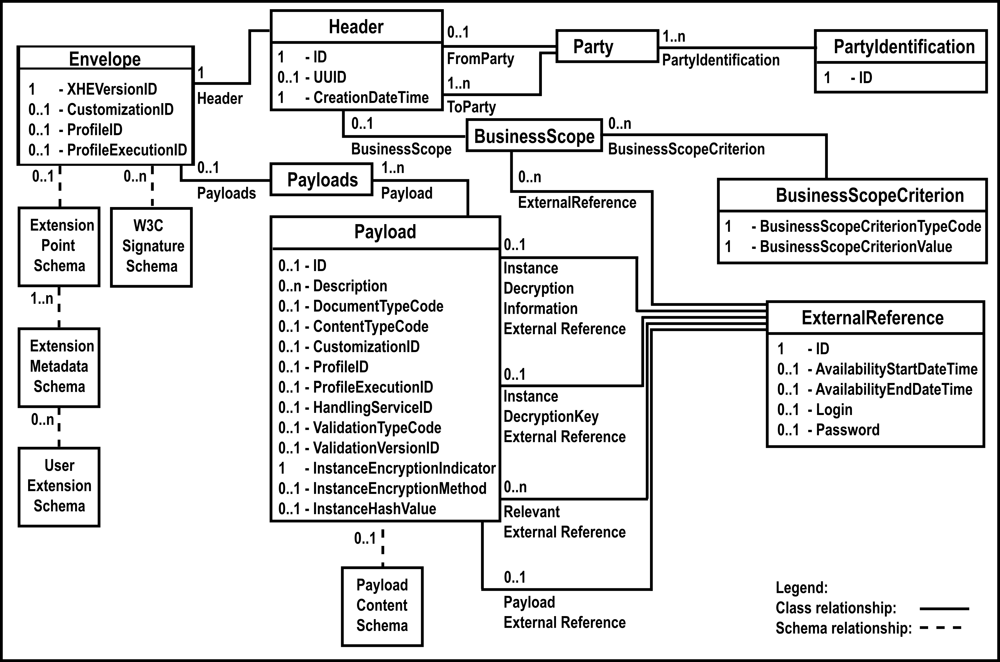

# XHE

### Overview
File or document headers have long been used to describe the information about a set of payloads in an entity that is kept separate and arm’s-length from the payloads themselves.

The metaphor of a paper envelope in which one places business documents for transport or management is apt to describe the role of an exchange header envelope in a container relationship to its payloads. Concepts of routing, authentication, non-repudiation and concealment all apply in both the metaphor and the electronic equivalent.

### What is an Exchange Header Envelope?
The Exchange Header Envelope (XHE) specifies an XML vocabulary [XML] expressing in machine-processable syntax the semantics of describing either a header to or an envelope of a set of payloads of content with information about that content. This vocabulary is modeled using the UN/CEFACT Core Component Technical Specification Version 2.01 [CCTS 2.01].

XHE, a specification developed jointly by UN/CEFACT and OASIS, is the successor to the UN/CEFACT Standard Business Document Header (SBDH) version 1.3 [SBDH] and the OASIS Business Document Envelope (BDE) version 1.1 [BDE].

#### Note regarding publications
The UN/CEFACT Exchange Header Envelope and the OASIS Exchange Header Envelope are the same specification developed in collaboration and published as standards by the two organizations following the practices of each.





### XHE Mapping Guide


XHE/xha:Payloads/xha:Payload/xhb:ProfileID

XHE/xhb:ProfileID


### XHE/xha:Payloads/xha:Payload/xhb:ProfileExecutionID

```xml

<xhb:ProfileExecutionID>
  xyz123
</xhb:ProfileExecutionID>
```


### XHE/xhb:ProfileExecutionID

```xml
<xhb:ProfileExecutionID>
  xyz123
</xhb:ProfileExecutionID>
```

### XHE/xha:Payloads/xha:Payload/xhb:ProfileID

```xml
<xhb:ProfileID schemeDataURI="http://www.example.com/Invoice">Invoicing Process version 1.0
</xhb:ProfileID>
```


### XHE/xhb:ProfileID

```xml
<xhb:ProfileID schemeDataURI="http://www.example.com/MsgProcess">Messaging Process version 1.0
</xhb:ProfileID>
```


### XHE/xha:Payloads/xha:Payload/xhb:CustomizationID

```xml
<xhb:CustomizationID schemeDataURI="http://www.example.com/CustomDoc">Example Document version 1.0
</xhb:CustomizationID>
```

### XHE/xhb:CustomizationID

The Payload/CustomizationID identifies an agreement to use a subset or a user defined model of a business document associated with the XHE header envelope. When an SBDH business scope type is used for describing such a convention, the SBDH BusinessScope/Scope/InstanceIdentifier value is placed as the value of the XHE Payload/CustomizationID, while the SBDH Identifier can be expressed using the [CCTS] derived attributes of the Payload/CustomizationID element.

### XHE/xhb:CustomizationID

```xml
<xhb:CustomizationID schemeDataURI="http://www.example.com/CustomHeader">Example Header version 1.0
</xhb:CustomizationID>
```


### Payload/xhb:DocumentTypeCode

The BDE DocumentTypeID identifies the document type of a business document, such as “Order”, “Invoice”, a URN, or using any convention agreed upon by the parties. The equivalent in XHE is the DocumentTypeCode, with the important difference that the BDE DocumentTypeID is a [CCTS] Identifier type, while the XHE DocumentTypeCode is a [CCTS] Code type.

```xml
<xhb:DocumentTypeCode>

  Invoice

</xhb:DocumentTypeCode>
```

### Payload/xhb:ContentTypeCode

The BDE InstanceSyntaxID indicates the syntax used to express and structure a business document, such as a MIME type or a markup language. The equivalent in XHE is the ContentTypeCode, with the important difference that the BDE InstanceSyntaxID is a [CCTS] Identifier type, while the XHE ContentTypeCode is a [CCTS] Code type.

 ```xml
 <xhb:ContentTypeCode listID="MIME">
  text/plain
</xhb:ContentTypeCode>

```


